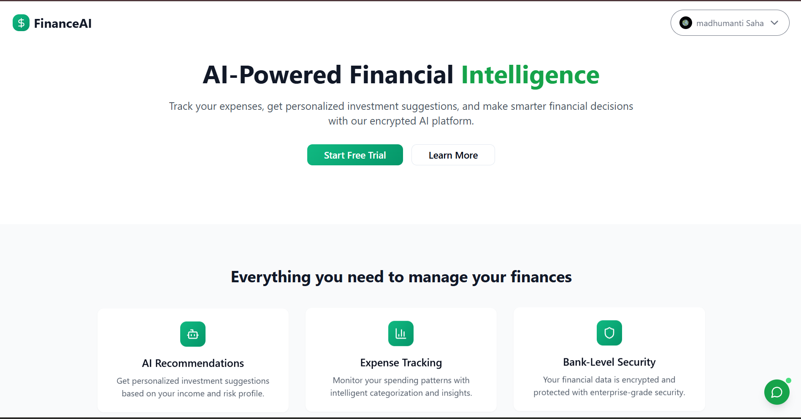

# 🚀 FinanceAI - AI-Powered Financial Intelligence Platform



**FinanceAI** is a revolutionary AI-powered financial management platform that combines intelligent expense tracking, personalized investment recommendations, and secure financial planning. Built for the modern investor, it leverages cutting-edge AI technology to democratize financial intelligence and empower users to make smarter financial decisions.

## 🎯 Problem Statement

In today's complex financial landscape, individuals struggle with:

- **Lack of personalized financial guidance** - Generic advice doesn't account for individual circumstances
- **Poor expense tracking** - Manual tracking is tedious and often inaccurate
- **Investment confusion** - Overwhelming options without clear direction
- **Security concerns** - Hesitation to share financial data online
- **Limited financial literacy** - Difficulty understanding complex financial concepts

## 💡 Innovation and Creativity


- **Personalized Financial Advisor**: Custom AI recommendations based on individual risk profiles, income, and goals
- **Intelligent Risk Assessment**: Advanced algorithm that considers age, income-to-expense ratios, savings, and user risk tolerance
- **Dynamic Investment Suggestions**: Real-time recommendations for SIPs, Fixed Deposits, and trading opportunities
- **Natural Language Processing**: Conversational AI interface for complex financial queries


- **Civic Authentication**: Web3-based identity verification ensuring user privacy
- **Encrypted Data Storage**: Bank-level security for sensitive financial information
- **Decentralized Identity**: User control over personal data without third-party dependencies


- **Predictive Spending Patterns**: AI-powered expense categorization and trend analysis
- **Budget Optimization**: Intelligent suggestions for budget allocation and savings
- **Goal Tracking**: Visual progress tracking for financial milestones


- **Email Notifications for Budget Alerts**: Automated email alerts sent to users when their monthly spending exceeds a user-defined budget limit, enabling proactive financial control.
- **Tax Optimizer**: An AI-driven tool using TaxVox that calculates tax liabilities based on income, expenses, and investments, offering personalized strategies to minimize tax burdens and optimize financial outcomes.


## 🛠️ Tech Stack

### Frontend Architecture

- **React 18**
- **JavaScript**
- **Vite**
- **Tailwind CSS**
- **shadcn/ui**
- **React Router**
- **React Query**

### Backend Infrastructure

- **Node.js**
- **MongoDB**
- **JWT Authentication**
- **CORS**
- **Environment-based configuration**

### Authentication

- **Civic Auth**

### AI Integration

- **Google Gemini 2.5 Flash**
- **Custom Risk Profiling Algorithm**
- **Prompt Engineering**


## 🎨 Design and Usability

### Key Features

1. **Smart Dashboard**: Real-time financial overview with AI insights
2. **Expense Tracker**: Intelligent categorization with spending analytics
3. **AI Recommendations**: Personalized investment advice based on profile
4. **Profile Management**: Comprehensive financial profile setup
5. **Security Center**: Transparent data handling and privacy controls
6. **AI Chatbot**: AI designed to accurately predict future market trends and overall price movements across various financial sectors
7. **Tax Optimization**: AI-powered tax planning and optimization

### User Experience Design

- **Intuitive Dashboard**: Clean, modern interface with key metrics at a glance
- **Progressive Disclosure**: Information revealed based on user needs and expertise level
- **Responsive Design**: Seamless experience across desktop, tablet, and mobile devices
- **Accessibility**: WCAG compliant with keyboard navigation and screen reader support

### Visual Design System

- **Modern Glass Morphism**: Contemporary UI with backdrop blur effects
- **Gradient Accents**: Professional color scheme with green financial themes
- **Micro-interactions**: Smooth animations and hover effects for better engagement
- **Data Visualization**: Charts and graphs for financial insights

### 

## 🌟 Impact and Potential

### Target Impact

- **Democratizing Financial Advice**: Making professional financial guidance accessible to everyone
- **Improving Financial Literacy**: Educational content and explanations for complex concepts
- **Reducing Financial Stress**: Automated tracking and smart recommendations
- **Increasing Investment Participation**: Lowering barriers to entry for new investors

### Scalability

- **Microservices Architecture**: Ready for horizontal scaling
- **Cloud-Native Design**: Deployable on any cloud platform
- **API-First Approach**: Easy integration with third-party financial services
- **Multi-tenant Support**: Can serve individual users and financial institutions

### Market Potential

- **Growing FinTech Market**: $179.8 billion market size with 23.58% CAGR
- **AI in Finance**: $9.45 billion market expected to reach $26.67 billion by 2026
- **Personal Finance Apps**: 3.4 billion users expected by 2026
- **Indian Market**: 1.4 billion population with increasing digital adoption

## 🚀 Getting Started

### Prerequisites

- Node.js 18+ and npm
- MongoDB database
- Google Gemini API key
- Civic authentication credentials

### Installation

1. **Clone the repository**

```bash
git clone <repository-url>
cd h4b
```

2. **Backend Setup**

```bash
cd backend
npm install
cp .example.env .env
# Configure your environment variables
npm start
```

3. **Frontend Setup**

```bash
cd frontend
npm install
cp .example.env .env
# Configure your environment variables
npm run dev
```

4. **AI Model Setup**

```bash
cd model
pip install -r requirements.txt
# Configure Gemini API key in .env
```

### Environment Variables

**Backend (.env)**

```
MONGODB_URI=your_mongodb_connection_string
PORT=3000
```

**Frontend (.env)**

```
VITE_CivicClientID=your_civic_client_id
VITE_GeminiAPI=your_gemini_api_key
VITE_BACKEND_URL=http://localhost:3000
```

### 🛡️ Security Features

- **End-to-end encryption** for sensitive financial data
- **Civic Web3 authentication** for decentralized identity
- **JWT token-based sessions** with secure storage
- **CORS protection** against unauthorized access

### 📈 Performance Optimizations

- **Code splitting** for faster initial load
- **Lazy loading** of components and routes
- **Image optimization** and compression
- **Caching strategies** for API responses
- **Database indexing** for faster queries
- **CDN integration** for static assets

## 🔮 Future Roadmap

### Phase 1: Advanced Features

- **Native App**: iOS/Android app with SMS-based transaction history fetching and automize budget tracking.
- **Credit Score Tracker**: AI-driven credit score monitoring and improvement tips.
- **Financial Health Check**: AI analysis of uploaded financial documents for personalized recommendations.
- **Secure Data**: End-to-end encryption, IPFS storage, and blockchain access control.
- **Portfolio & Goal Management**: Track investments and financial milestones.

### Phase 2: Enterprise Features

- **Multi-user Support**: Family/business accounts.
- **API Marketplace**: Third-party integrations.
- **Advanced Analytics**: Predictive insights.
 

**Project Repository**: https://github.com/Soumojitshome2023/h4b-last-brain-cell

**Live Demo**: https://h4b-lastbraincell.vercel.app/


## 👥 Created by

**Team Last Brain Cell**
- [@Soumojit](https://github.com/Soumojitshome2023)
- [@Satwik](https://github.com/Rick-03)
- [@Atrayee](https://www.github.com/vamus092)
- [@Madhumanti](https://www.github.com/MadhumantiSaha/)
