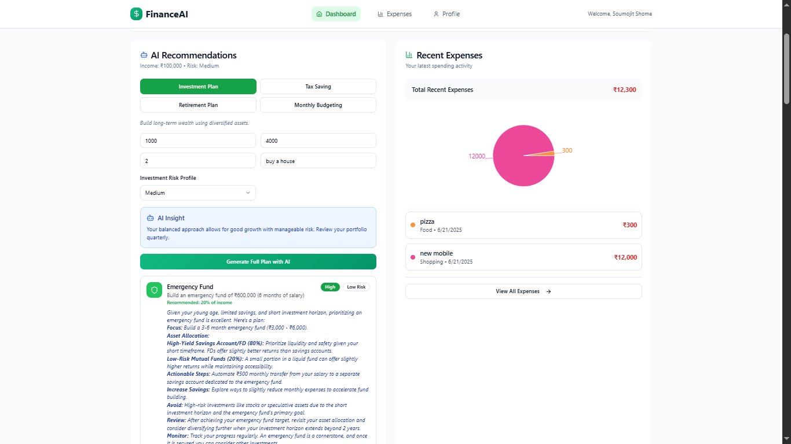
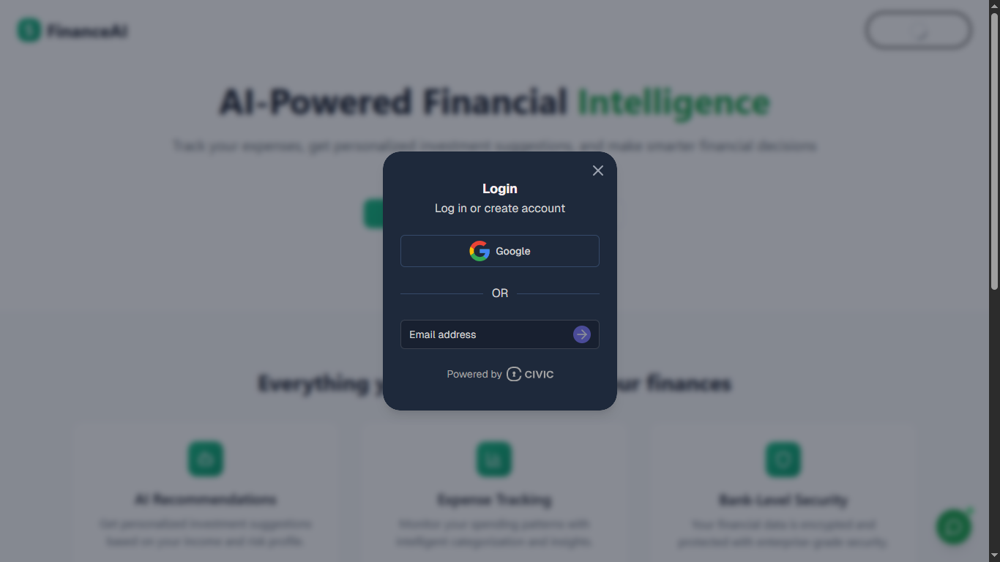
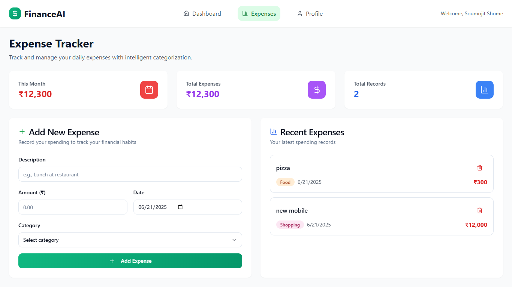
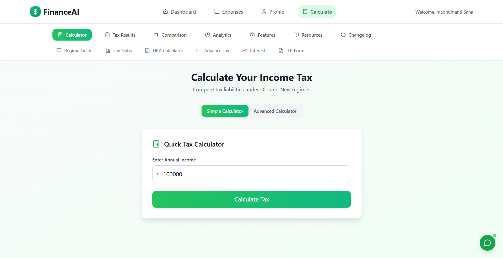

<p align="center">
  
</p>


# 💸 FinanceAI – AI-Powered Financial Intelligence Platform


**FinanceAI** is your smart financial partner – combining intelligent expense tracking, personalized investment advice, and secure financial planning in one sleek platform. Built for young adults and modern investors, it brings **AI, Web3 security, and intuitive design** together to make finance easy and powerful.

---

## 🎯 Problem We’re Solving

> Most people find managing their finances frustrating. Here's why:

- 📉 **No personalized advice** – One-size-fits-all doesn’t work
- 💸 **Messy expense tracking** – Manual tracking is painful
- 🌀 **Investment confusion** – Too many options, no clear guidance
- 🔐 **Security worries** – People don’t trust sharing financial info online
- 📚 **Low financial literacy** – Finance terms are often overwhelming

---

## 💡 What Makes FinanceAI Special?



### 🤖 Smart Features You’ll Love:
- 🎯 **AI-Based Financial Advisor**  
  Personalized advice based on your **income**, **risk**, and **goals**
- 🧠 **Intelligent Risk Profiling**  
  Analyzes **age, savings, income-to-expense ratio, and risk tolerance**
- 📊 **Real-time Investment Suggestions**  
  Includes **SIPs**, **FDs**, and **market trades**
- 💬 **Conversational AI Chatbot**  
  Ask complex financial questions using natural language



### 🔒 Security-First Design:
- 🆔 **Web3 Civic Auth** for decentralized identity verification
- 🔐 **End-to-end encrypted data storage**
- 🔓 **You control your data** – no third-party dependency



### 💰 Expense & Budget Management:
- 🧾 **Automatic Expense Categorization**
- 📉 **Spending Pattern Predictions**
- 💡 **Budgeting Tips & Goal Tracking**



### 📬 Extra Goodies:
- ✉️ **Email Alerts** for budget breaches
- 🧮 **Tax Optimizer** powered by TaxVox  
  Calculates your tax & suggests **savings strategies**

---

## 🛠️ Tech Stack

### 💻 Frontend
- React 18 ⚛️  
- Vite ⚡  
- Tailwind CSS 💅  
- shadcn/ui 🧩  
- React Router & Query 🧭  

### 🌐 Backend
- Node.js 🚀  
- MongoDB 🍃  
- JWT Authentication 🔐  
- CORS + .env configuration  

### 🤖 AI & Intelligence
- Google Gemini 2.5 Flash ⚡🧠  
- Custom Risk Profiling Algorithm  
- Prompt Engineering  

### 🔐 Authentication
- Civic Web3-based Identity Verification  

---

## 🧠 UX & Design Principles

### ✨ Key Features:
1. 📈 **Smart Dashboard** – All your finances in one view  
2. 📊 **Expense Analyzer** – AI categorization & visual trends  
3. 🤖 **AI Investment Advisor** – Personalized tips & predictions  
4. 👤 **User Profile Management**  
5. 🛡️ **Security Center** – Transparent data policies  
6. 💬 **Finance Chatbot** – Ask, learn, invest  
7. 💸 **Tax Optimizer** – Know, plan, save  

### 🎨 Design Aesthetics:
- 🧊 **Glassmorphism UI** – Sleek and modern  
- 🌈 **Green Financial Gradients**  
- 📉 **Interactive Charts & Graphs**  
- 🦾 **Micro-interactions & animations**  

---

## 🌟 Why This Matters

### 🌍 Real-World Impact:
- 🧠 **Financial Literacy** – Simplified guidance for everyone  
- 🔓 **Access to Financial Tools** – Even for first-time users  
- 😌 **Reduced Financial Stress** – With proactive AI alerts  
- 📈 **Boosted Investment Confidence**

### 📈 Market Opportunity:
- 🌐 $179.8B Fintech Market (23.58% CAGR)
- 🤖 $9.45B AI in Finance (Expected $26.67B by 2026)
- 📱 3.4B Personal Finance App Users Expected by 2026
- 🇮🇳 Huge potential in India’s rising middle-class (1.4B+ users)

---

## 🚀 How to Get Started

### ✅ Prerequisites
- Node.js 18+  
- MongoDB instance  
- Gemini API Key (Google AI Studio)  
- Civic Auth credentials  

---

### 🛠️ Installation Steps

1. **Clone the Repo**

```bash
git clone https://github.com/Soumojitshome2023/h4b-last-brain-cell.git
cd h4b-last-brain-cell
````

2. **Backend Setup**

```bash
cd backend
npm install
cp .example.env .env    # Update your environment variables
npm start
```

3. **Frontend Setup**

```bash
cd frontend
npm install
cp .example.env .env    # Add API keys and configs
npm run dev
```

4. **AI Model Setup**

```bash
cd model
pip install -r requirements.txt
# Add Gemini API Key in .env
```

---

### 🔐 Environment Variables

**Backend (`.env`)**

```
MONGODB_URI=your_mongodb_connection
PORT=3000
```

**Frontend (`.env`)**

```
VITE_CivicClientID=your_civic_id
VITE_GeminiAPI=your_gemini_key
VITE_BACKEND_URL=http://localhost:3000
```

---

## 🛡️ Security Highlights

* 🔐 End-to-End Encrypted Data Handling
* 🆔 Web3 Authentication (Civic)
* 🔑 JWT-Based Secure Sessions
* 🌐 CORS Protected API

---

## ⚙️ Performance Boosts

* 🚀 Lazy Loading & Code Splitting
* 🗂️ Image & Asset Optimization
* 🔁 Caching of API Responses
* 📊 Indexed MongoDB Collections
* 🌍 CDN-Powered Static Assets

---

## 🔮 What’s Next

### 🔧 Phase 1:

* 📱 Native Mobile App (Android/iOS)
* 📉 Credit Score Monitoring AI
* 📂 Financial Health Analysis from Docs
* 🛠️ Blockchain + IPFS Secure Storage
* 🎯 Investment & Goal Tracking

### 🏢 Phase 2:

* 👥 Multi-User Family/Team Accounts
* 🔌 3rd-Party API Marketplace
* 📈 Enterprise-Grade Predictive Analytics

---

## 🔗 Links

* 🚀 **Live Demo**: [https://h4b-lastbraincell.vercel.app/](https://h4b-lastbraincell.vercel.app/)
* 🗂️ **GitHub Repo**: [github.com/Soumojitshome2023/h4b-last-brain-cell](https://github.com/Soumojitshome2023/h4b-last-brain-cell)

---

## 👥 Team Last Brain Cell

* 🧠 [Soumojit](https://github.com/Soumojitshome2023)
* ⚙️ [Satwik](https://github.com/Rick-03)
* 🎨 [Atrayee](https://github.com/vamus092)
* 📊 [Madhumanti](https://github.com/MadhumantiSaha)

---

> Made with 💚 for smarter finance!
